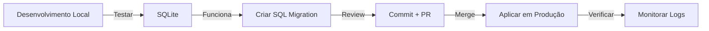

# 📋 SISTEMA DE MIGRATIONS - DOCUMENTAÇÃO CONSOLIDADA

## Visão Geral

Este projeto tinha **3 sistemas de migrations paralelos** que foram consolidados:

1. ~~`alembic/`~~ → **Descontinuado** - Mantido apenas para referência histórica
2. ~~`backend/migrations/`~~ → **Descontinuado** - Scripts Python legados
3. **`migrations/`** → **SISTEMA OFICIAL** - SQL direto com versionamento

## 🎯 Sistema Oficial: `migrations/`

### Estrutura

```
migrations/
├── env.py                              # Configuração Alembic (não usar diretamente)
├── versions/                           # Arquivos de versão Alembic (legado)
├── create_all_config_tables.sql        # ✅ Schema completo de configuração
├── create_google_tokens_table.sql      # ✅ Tabela de tokens Google OAuth
├── create_permissions_table.sql        # ✅ Sistema de permissões
├── create_risc_events_table.sql        # ✅ Eventos RISC (segurança)
├── create_tags_sistema.sql             # ✅ Tags do sistema
├── producao_melhorias_2025-12-22.sql   # ✅ Melhorias de produção
└── producao_melhorias_SIMPLES.sql      # ✅ Melhorias simplificadas
```

### Como Executar Migrations

#### Desenvolvimento Local (SQLite)
Migrations são aplicadas automaticamente pelo `schema.py` na inicialização.

#### Produção (PostgreSQL)

1. **Conectar ao banco de produção**:
   ```bash
   # Via Render Dashboard ou pgAdmin
   psql $DATABASE_URL
   ```

2. **Executar SQL**:
   ```bash
   \i migrations/create_all_config_tables.sql
   ```

3. **Verificar**:
   ```sql
   SELECT table_name FROM information_schema.tables 
   WHERE table_schema = 'public';
   ```

### Como Criar Nova Migration

1. Criar arquivo SQL em `migrations/`:
   ```
   migrations/YYYY-MM-DD_descricao_da_mudanca.sql
   ```

2. Incluir header padrão:
   ```sql
   -- =====================================================
   -- Migration: descricao_da_mudanca
   -- Data: YYYY-MM-DD
   -- Autor: seu_nome
   -- =====================================================
   -- Descrição:
   -- [Descrever o que a migration faz]
   -- =====================================================
   
   -- UP: Aplicar mudanças
   BEGIN;
   
   -- Suas alterações aqui
   
   COMMIT;
   
   -- DOWN: Reverter mudanças (comentado, usar manualmente se necessário)
   -- BEGIN;
   -- DROP TABLE IF EXISTS sua_tabela;
   -- COMMIT;
   ```

3. Documentar no CHANGELOG ou README

## ⚠️ Sistemas Legados (NÃO USAR)

### `backend/migrations/` (Descontinuado)
Scripts Python que foram usados para migrations específicas.
Mantido apenas para referência histórica.

### `alembic/` config (Descontinuado)
Configuração Alembic que não deve ser usada.
O arquivo `alembic.ini` na raiz é mantido para compatibilidade,
mas não é o método preferido.

## 🔄 Fluxo de Trabalho Recomendado



## 📝 Convenções

1. **Nomes de arquivo**: `YYYY-MM-DD_descricao.sql`
2. **Sempre usar transações**: `BEGIN; ... COMMIT;`
3. **Incluir DOWN migration**: Comentada, para rollback manual
4. **Testar localmente**: Antes de aplicar em produção
5. **Backup**: Sempre fazer backup antes de migrations destrutivas

## 🚨 Checklist de Deploy

- [ ] Migration testada localmente
- [ ] Backup do banco de produção realizado
- [ ] SQL revisado por outro desenvolvedor
- [ ] Migration aplicada em staging (se disponível)
- [ ] Monitoramento de erros ativo
- [ ] Rollback plan documentado
